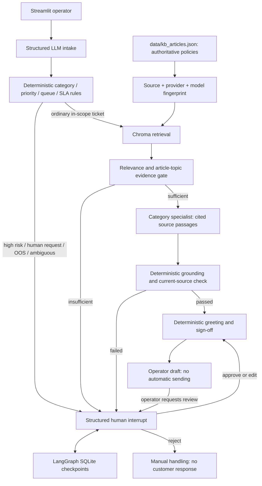

# Evidence-Grounded Support Triage Workbench

**ACCEPTANCE PASS — PORTFOLIO READY**

[](https://github.com/mimohnaik-git/FDE_Project_Support-Triage/actions/workflows/ci.yml)

PR [#1](https://github.com/mimohnaik-git/FDE_Project_Support-Triage/pull/1) merged successfully. Post-merge GitHub Actions
run [37110362584](https://github.com/mimohnaik-git/FDE_Project_Support-Triage/actions/runs/37110362584) completed with **SUCCESS**; 51 tests passed.
Original authoritative baseline: `157fa6f27897772ededacef3623ad693067bb294`.
Feature commit: `0b33ad8943cd05e370be1a36b16156f3d5ba4f5f`.
Current `main`: `a41c0e141a5885483c950426a5d3d5cef6671198`. The imported local folder initially lacked
`.git`, then was reattached to authoritative GitHub `main @ 157fa6f`.
Live-model quality remains unmeasured.

A support-operations demo that classifies customer intake, chooses an owning queue,
retrieves company policy, abstains without sufficient evidence, and persists human review.
It addresses manual classification, misrouting, knowledge search, unsupported answers,
and inconsistent handoffs. No measured claim of real operational cost or time savings is made.

## Architecture and workflow

The existing Python 3.12, Streamlit, LangGraph and Chroma stack is retained.
Business logic lives in `support_triage/agents.py`, `support_triage/policy.py`, `support_triage/graph.py`, and `support_triage/kb.py`; `app.py` is the operator UI.



Intake uses a Pydantic schema. Deterministic rules assign category, priority,
assigned_queue, handling_action, routing_reason, evidence_status, human_review_required,
and a demo SLA class. SLA classes express handling order, not a promised production response time.
Queues are billing-support, technical-support, customer-support, or support-supervisor.
Legal/security/dispute/outage indicators override ordinary handling; human requests,
unsupported or ambiguous categories require review.

`data/kb_articles.json` remains unchanged and authoritative. Chroma collection identity
includes a canonical SHA-256 source fingerprint and embedding provider/model, so changed
policies get a fresh index. Retrieval preserves IDs, categories, titles, text and distances.
Old version collections remain local caches and can be removed when no longer needed.

Evidence uses lexical coverage plus explicit article-topic anchors. The `0.35` coverage
threshold was selected on six separate calibration cases with zero weighted errors
(false acceptance costs five times false rejection). Distances are displayed/retained,
but no unvalidated cross-provider distance cutoff is used. This small calibration is
limited to the supplied English corpus. A cancellation/fee overlap regression from
CLINC motivated the subscription-topic compatibility check.

Specialist drafts are deliberately **extractive**, retaining relevant `[article-id]`
passages verbatim. A deterministic check rejects missing evidence, foreign IDs,
changed source text, paraphrased or contradictory policy facts, and extra unsupported claims.
The final composer adds only fixed greeting/sign-off text. There is no second LLM judge.
This conservative contract trades conversational polish for verifiable policy facts.

## Human review

SQLite checkpoints at `data/reviews.sqlite` persist tickets, evidence, interrupts and decisions.
Restart Streamlit and select a pending review in the sidebar to recover it.
Approve requires an existing grounded draft and unchanged current KB evidence.
Edit requires a nonempty operator response. Reject produces no customer response and
marks manual handling. Every decision requires a reviewer and reason; invalid submissions
leave the review pending. Human edits are explicitly human-authored and are not labeled
as automatically grounded. Approval, editing and rejection are covered by graph and UI tests.

## Setup and run

From the project root with Python 3.12:

```powershell
python -m venv .venv
.\.venv\Scripts\python.exe -m pip install -r requirements-dev.txt -c constraints.txt
Copy-Item .env.example .env
.\.venv\Scripts\python.exe -m streamlit run app.py
```

On Linux/macOS use `.venv/bin/python` instead. Runtime-only installation uses
`requirements.txt`; test/eval tools use `requirements-dev.txt`. `constraints.txt` pins
the complete accepted local environment. `pip check` passed on Python 3.12.14/Windows;
post-merge Ubuntu GitHub Actions run `37110362584` completed successfully.
Chroma brings some upstream transitive packages (including the Kubernetes client);
the application introduces no Kubernetes service or other new infrastructure.

Choose OpenAI, Anthropic, or a local Ollama chat model in the sidebar. Auto resolves
OpenAI credentials first, then Anthropic credentials, then Ollama. Model overrides are
supported. For Ollama install the server and pull the selected model before running.
Embedding choices are OpenAI `text-embedding-3-small` or local `all-MiniLM-L6-v2`.
Local embeddings need an initial ONNX model download, then can operate offline.
Paid providers require your own keys and may incur charges. Provider availability and
real-model quality have not been verified through paid calls in this build.

Environment or `.env` credentials are read without overwriting process environment;
sidebar keys stay in Streamlit session configuration and are never placed in graph state.
Do not commit `.env`, Chroma caches, SQLite checkpoints, or customer ticket exports.
User-facing failures show an opaque reference; local diagnostics retain exception type
and stack locations without logging raw provider messages, credentials, or customer text.
All customer/model output uses Streamlit text rendering rather than unsafe HTML.

## Offline verification and measured results

```powershell
.\.venv\Scripts\python.exe -m pip check
.\.venv\Scripts\python.exe -m ruff check .
.\.venv\Scripts\python.exe -m compileall -q app.py support_triage evaluation
.\.venv\Scripts\python.exe -m pytest -q
.\.venv\Scripts\python.exe -m evaluation.run --output evaluation/results/smoke.json
```

Local verification: **51 tests passed**, with three upstream Chroma fixture-configuration deprecation warnings.

Tests use fake structured chat and fixed feature-hash embeddings for actual Chroma
integration; they require no keys, downloaded models, or external network. An autouse
socket guard blocks external connections, allowing only local sockets needed by
Streamlit/asyncio. CI installs packages normally, then runs deterministic offline checks.

These are **executed workflow regression results with fake intake and lexical retrieval**,
not evidence that a live LLM or embedding model achieves these accuracies.
Full results include all requested metrics and denominators in `evaluation/results/*.json`.

| Acceptance metric | Project-native gold (18 cases) |
|---|---:|
| Category accuracy / macro-F1 | 100% / 1.000 |
| Priority accuracy / macro-F1 | 100% / 1.000 |
| Human-review precision / recall / F1 | 1.000 / 1.000 / 1.000 |
| False-safe rate | 0% |
| OOS abstention accuracy | 100% |
| Hit@1 / Hit@2 / Recall@2 (10 evidence-labeled cases) | 100% / 100% / 100% |
| Evidence-supported automatic response rate | 100% |
| Grounding violations | 0 |
| Human-review rate / automatic-draft coverage | 44.44% / 55.56% |
| Assisted coverage | 0% (evaluation leaves reviews pending) |
| Median / p95 workflow latency | 45.50 / 450.23 ms |
| Intake calls / retrieval calls per run | 1 / 0.6111 |

The escalation metrics measure the binary required-review decision, including evidence
abstention, not just the intake `escalation` category. Coverage counts drafts, not sent messages.
Latency includes SQLite checkpointing and fake calls; it is not live API latency.

| External challenge | Cases | Category accuracy / macro-F1 | False-safe | Review rate |
|---|---:|---:|---:|---:|
| Bitext | 32 | 37.5% / 0.233 | 0% | 96.88% |
| CLINC OOS | 32 | 90.62% / 0.238 | 0% | 100% |
| Reviewed B2B SaaS intake | 8 | 25.0% / 0.143 | 0% | 100% |

These weak fake-classifier routing results are retained openly. High review coverage
on foreign-domain corpora is expected from limited company policy, and is not a productivity claim.
Bitext and CLINC have no trustworthy mapped priority labels, so priority metrics are null.
The reviewed SaaS priority accuracy is 12.5% (macro-F1 0.111) with this fake classifier.
No unsupported metric is filled with an invented score.

## Data provenance and reproducing external challenges

`evaluation/datasets/gold.json` is the authoritative project-native acceptance set.
`evaluation/datasets/calibration.json` is separate evidence calibration data.
`evaluation/datasets/manifest.json` records licenses, exact upstream revisions, seeds, row counts,
mapping purposes, raw/sample hashes and whether raw data is committed.

Public sources: [Bitext](https://huggingface.co/datasets/bitext/Bitext-customer-support-llm-chatbot-training-dataset)
(CDLA Sharing 1.0), [CLINC OOS](https://github.com/clinc/oos-eval) (repository CC BY 3.0),
and [Jurgen1161 B2B SaaS dialogue sample](https://huggingface.co/datasets/Jurgen1161/synthetic-b2b-saas-support-dialogues-sample)
(CC BY 4.0). Authors retain their respective rights. Raw third-party data and sampled
customer text are excluded from Git; only provenance, reviewed labels and derived metrics
are included in the merged implementation. Kaggle Twitter and BANKING77 are optional and were not acquired or evaluated.

```powershell
# Explicit network opt-in; pinned sources, seed 42, local ignored raw/sample files.
.\.venv\Scripts\python.exe -m evaluation.prepare --download
# Repeat preparation/evaluation from already-downloaded files, without network.
.\.venv\Scripts\python.exe -m evaluation.prepare
# Optional LIVE evaluation; may incur provider/embedding costs. Never run in CI.
.\.venv\Scripts\python.exe -m evaluation.run --live --provider ollama --embedding-provider local --output evaluation/results/live.json
```

Adapters copy only the customer instruction (Bitext), OOS utterance (CLINC), or first
customer dialogue turn (SaaS) into graph input. Category/priority/reference IDs remain
evaluation labels. Agent replies, outcome sentiment, resolution summaries and later
turns are never exposed at intake. SaaS labels are explicitly reviewed from initial
requests and documented in `evaluation/datasets/saas_labels.json`; they do not copy upstream
post-conversation escalation metadata. Third-party material cannot override company policy.

## Limits and human control

This is a local operator demo, not a production support service. There is no account
mutation, refund execution, email sending, authentication, tenant isolation, retention
policy, or multi-operator concurrency guarantee. Checkpoints contain sensitive ticket data:
secure the machine and storage before using real customer data. The UI's reviewer name
is an audit label, not verified identity. Local persistence scans are sized for demo volume.
Lexical gates and keyword risk rules can miss semantic nuances; the six-case calibration
and small challenge samples do not establish production reliability. Automated responses
quote policies rather than interpreting account-specific eligibility. Human edits remain
the reviewer's responsibility. Live-provider/embedding evaluation remains unexecuted;
post-merge hosted CI succeeded. API keys, sending responses, account actions, escalations and final decisions
remain human-controlled.

## Repository metadata suggestions

Description: “Evidence-grounded support triage with LangGraph, Chroma and durable human review.”
Topics: `langgraph`, `streamlit`, `rag`, `support-operations`, `human-in-the-loop`, `evaluation`.
License: choose an owner-approved code license (MIT is a possible option); no license is
assigned on your behalf. Third-party dataset licenses remain separate.
GitHub remote: [FDE_Project_Support-Triage](https://github.com/mimohnaik-git/FDE_Project_Support-Triage).
The CI badge above links to the configured workflow; post-merge run `37110362584` succeeded.
This documentation reconciliation makes no commit or push.
